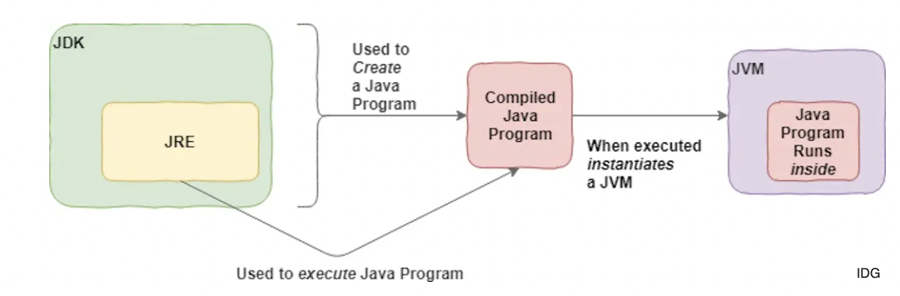
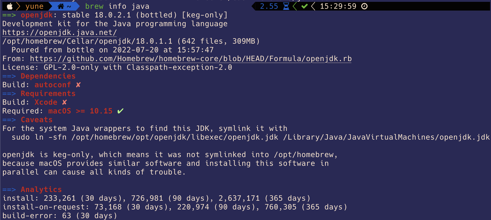

This is where I learn java multithread and redis.

Three core technology packages used in java programming

- The JDK provides the tools necessary to write Java programs that can be executed and run by the JVM and JRE.
- The JVM is the runtime that hosts running programs.
- The JRE is the on-disk part of Java that creates the JVM and loads programs into them.

**Difference between the Java Development Kit and the Java Runtime Environment.**
The distinction is that the JDK is a package of tools for developing Java-based software, whereas the JRE is a package of tools for running Java code.

### Relationship Graphs

For mac user use command `brew search java` and `brew info java` to find out some of the java path
For the system Java wrappers to find this JDK, symlink it with
sudo ln -sfn /opt/homebrew/opt/openjdk/libexec/openjdk.jdk /Library/Java/JavaVirtualMachines/openjdk.jdk

openjdk is keg-only, which means it was not symlinked into /opt/homebrew,
because macOS provides similar software and installing this software in
parallel can cause all kinds of trouble.

